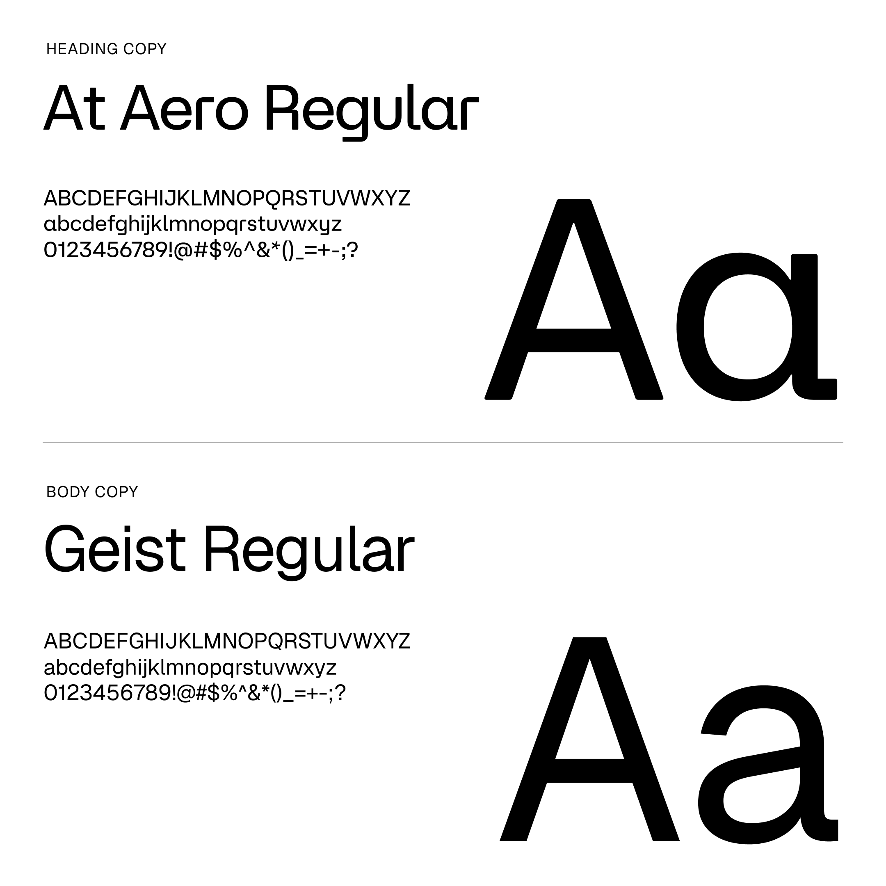

# Brand Kit

## Visual Style Guide

Hemi's Visual Style Guide provides guidelines and a standard for the visual of the Hemi brand. We recommend using this document as a starting point for the Hemi brand.



***

## Logo

The Hemi Logo is the primary representation of the brand and is comprised of the Hemi Symbol and the Hemi Wordmark.

#### A Few Ground Rules:

* The Symbol may be used independently of the Wordmark. However, the Symbol must always accompany the Wordmark, as the Symbol is essential to brand recognition.
* Do not try to recreate the Hemi Logo, Symbol, or Wordmark yourself. Use the logo assets provided by the Hemi Team.
* Do not adjust the elements in the Hemi Logo. Do not rotate, skew, move, or modify. Use the logo as provided.

For use on white or light backgrounds, use the [Positive Hemi Logo](brand-kit.md#positive-hemi-logo). For use on black or dark backgrounds, use the [Reversed Hemi Logo](brand-kit.md#reversed-hemi-log). This allows for all elements of the Hemi Logo to be clear and legible in many applications and use cases

<figure><figcaption></figcaption></figure>

#### Positive Hemi Logo

For use on white or light backgrounds.





#### Reversed Hemi Logo

For use on black or dark backgrounds.





***

## Symbol

The Symbol may be used independently of the Wordmark. However, the Symbol must always accompany the Wordmark, as the Symbol is essential to brand recognition.

When used independently of the Wordmark, the Hemi Symbol should be in the color Orange in all possibl e applications and use cases.

<figure><figcaption></figcaption></figure>

<figure><figcaption>
hemi-logo-orange.svg
</figcaption></figure> <figure><figcaption>
hemi-logo-orange.png
</figcaption></figure>

***

## Clear Zone

The Hemi Logo should be presented with a clear zone around it, ensuring that the mark will be clear and not overwhelmed by other marks or images.

To identify the clear zone for the Hemi Logo, use the diagram shown below. Clear zone measurements are based on the width of the Hemi Symbol.

<figure><figcaption></figcaption></figure>

***

## Alternate Logos

In certain cases, a one-color version of the logo may be necessary.&#x20;

For example, this is a common request for any screen printed materials, as the cost of the printing increases with each color added.

If used on an Electric Orange or Protocol Teal background, the One-Color Hemi Logo should be presented in White or Frost White.

<figure><figcaption></figcaption></figure>





























***

## Brand Colors

The Hemi Primary Color Palette is comprised of Electric Orange, Native Teal, Protocol Blue, Black and White.

<table><thead><tr><th width="199">Color</th><th width="265">Web Colors</th><th>Print Colors</th></tr></thead><tbody><tr><td><strong>Electric Orange</strong></td><td>Hex      <strong><code>#ff4600</code></strong> RGB     <strong><code>255, 70, 0</code></strong></td><td>CMYK:     <strong><code>0, 72, 100, 0</code></strong> Spot:        <strong><code>PMS 1655 C</code></strong></td></tr><tr><td><strong>Native Teal</strong></td><td>Hex      <strong><code>#002e32</code></strong> RGB     <strong><code>0, 46, 50</code></strong></td><td>CMYK:     <strong><code>100, 8, 0, 80</code></strong> Spot:        <strong><code>PMS 2217 C</code></strong></td></tr><tr><td><strong>Protocol Blue</strong></td><td>Hex      <strong><code>#002791</code></strong> RGB     <strong><code>0, 39, 145</code></strong></td><td>CMYK:     <strong><code>100, 73, 0, 43</code></strong> Spot:        <strong><code>PMS Dark Blue C</code></strong></td></tr><tr><td><strong>Black</strong></td><td>Hex      <strong><code>#000000</code></strong> RGB     <strong><code>0, 0, 0</code></strong></td><td>CMYK:     <strong><code>60, 40, 40, 100</code></strong> Spot:        <strong><code>Black</code></strong></td></tr><tr><td><strong>White</strong></td><td>Hex      <strong><code>#ffffff</code></strong> RGB     <strong><code>255, 255, 255</code></strong></td><td>CMYK:     <strong><code>0, 0, 0, 0</code></strong> Spot:        <strong><code>White</code></strong></td></tr></tbody></table>

<figure><figcaption></figcaption></figure>

***

## Typography

**AT Aero Regular** serves as Hemi’s heading typeface, used for larger applications and headlines, giving them an unmistakable Hemi look.&#x20;

**Geist Regular** is used as body copy, ensuring clear communication and legibility.

At Aero Regular is available upon request from the Hemi team.\
Geist can be downloaded from Google Fonts: [https://fonts.google.com/specimen/Geist](https://fonts.google.com/specimen/Geist)

<figure><figcaption></figcaption></figure>

***

## Token logos




