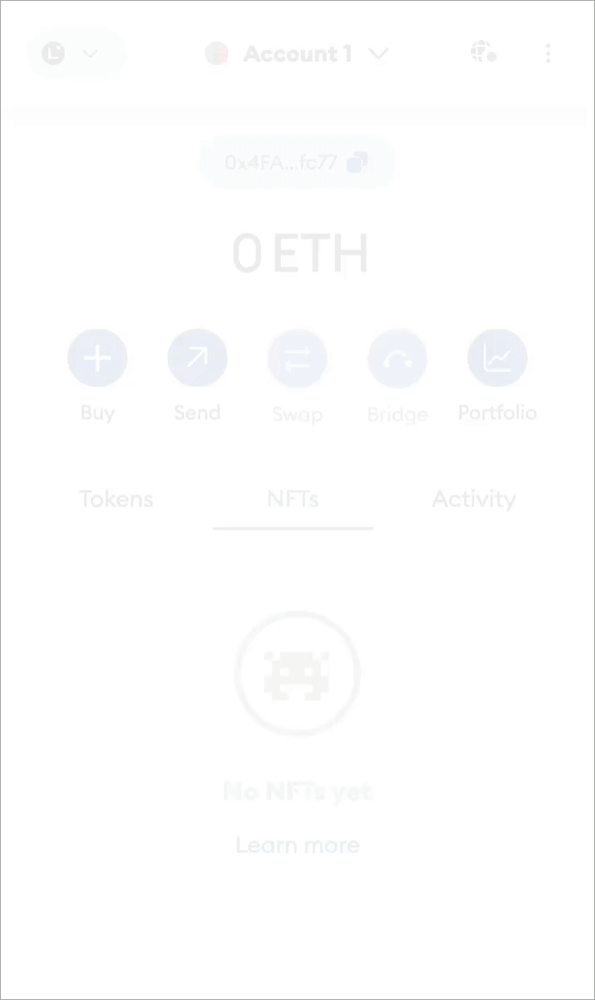

# Claim a Capsule


## 📜 **TL;DR:**

* This tutorial walks you through claiming your onboarding Capsule.
* There are NO prerequisites to claim a Capsule. If you do not have an EVM or BTC address, Capsule can create one for you!


***

## 🏁 Prerequisites

1. **NONE!**

***

## 📚 Tutorial

### **1. Join the Hemi Discord**

* Join the Hemi [Discord](https://discord.gg/hemixyz) and find the `#claim-capsule` channel. Click "Claim" to request your Capsule.
* **Only ONE Capsule can be claimed per user.**&#x20;


If you do not see the `#claim-capsule` channel in the left menu bar, click "Channels & Roles" -> "Browse Channels" to view / add other channels.&#x20;



<figure><figcaption></figcaption></figure>

***

### **2. Check your Discord DMs**

* **Y**ou will receive a DM from one of the Hemi team members with your Capsule URL link.&#x20;


If you encounter any issues or do not receive your DM within 24 hours, create a ticket in the `#ticket` channel on [Discord](https://discord.gg/hemixyz)**.** &#x20;


<figure><figcaption><p>Example DM to claim your Capsule</p></figcaption></figure>

***

### 3. Click the Capsule URL in your Discord DM

* **Landing Page:** You will be directed to a page like this.
* Click `Redeem`

<figure><figcaption></figcaption></figure>

***

### 4. Connect to Claim

* Enter the receiving Hemi Sepolia address or connect your preferred EVM wallet.

<figure><figcaption></figcaption></figure>

* **Network Warning:** Make sure to switch to the Hemi Sepolia Network. (A warning will pop up if you haven't switched.)

<figure><figcaption></figcaption></figure>

<figure><figcaption></figcaption></figure>


Note: You will receive an error when trying to claim your Capsule if you have not switched to the Hemi Sepolia Network.


<figure><figcaption></figcaption></figure>

***

### 5. Redeem

* Once you are properly connected, you can click `Redeem`.

<figure><figcaption></figcaption></figure>

***

## Optional: Start PoP Mining Today

* Anyone can do this! We have a [beginner](../pop-mining/)[ and advanced tutorial on how to start PoP mining.](../pop-mining/)
* Enter the receiving BTC address or click to have Capsule create one for you to get started!&#x20;


Make sure you save the&#x20;


<figure><figcaption></figcaption></figure>

***

## 6. Transaction Progress

* You should see the screen below if everything was inputted correctly.&#x20;

<figure><figcaption></figcaption></figure>

* Click **`View the onboarding transaction here`**

<figure><figcaption></figcaption></figure>

***

**🥚 Easter Egg**

* **Hidden Surprise**: If you've reached this part of the documentation, congrats, you've discovered an Easter egg! Remember the little surprise we mentioned earlier?&#x20;
*   When you click **`View the onboarding transaction here`** (from the previous step) you will see the different Tokens transferred.

    <figure><figcaption></figcaption></figure>
* **Air Hemi Hatchling:** You'll notice several items were transferred, including an Air Hemi Hatchling. An **Air Hemi Hatchling is only available in a Capsule.**
  * A Hemi Hatchling offers an immersive introduction to the Hemi Network's approach to scaling the Ethereum and Bitcoin networks, merging elemental lore with blockchain finality principles.&#x20;
  * **PoP Protocol:** Hemi Hatchlings use the PoP protocol to achieve Superfinality. Read more about that at [pop-consensus-and-bitcoin-finality.md](../../foundational-topics/proof-of-proof/pop-consensus-and-bitcoin-finality.md "mention").
*   **Collect Other Hatchlings:** You can collect other elemental hatchlings by visiting [Hemi Hatchlings](https://hemihatchlings-test.hemi.xyz/) and learning more about how it works.

    

***

**How to View Your Hemi Hatchling**

1. In your MetaMask wallet, under NFTs, you should see your Hemi Hatchling. If you don't, you may need to add your Hatchling manually.&#x20;

.png>)

***

2. **Find your NFT ID**

* On the [Hemi Explorer](https://testnet.explorer.hemi.xyz/), type in your address.
* On the `Address details` page, click `NFTs`

<figure><figcaption></figcaption></figure>

* Locate the ID&#x20;

<figure><figcaption></figcaption></figure>

***

* Go to MetaMask and click `Import NFT`

<figure><figcaption></figcaption></figure>

* Click `Import`
  * Enter the [Air Hemi Hatchling Address](https://testnet.explorer.hemi.xyz/token/0x3F5c3083EC12bd7301371655714A0896e8d56f22) and **your Token ID**

```
0x3F5c3083EC12bd7301371655714A0896e8d56f22
```

<figure><figcaption></figcaption></figure>

***

* **Success! Your NFT was added!**
  * **Pixelated Hatchlings:** All Hemi Hatchlings during the testnet will be pixelated. This is intentional.
  * **Air Hemi Hatchling Airdrop:** If you claim an Air Hemi Hatchling, you will receive an airdrop of that Hemi Hatchling during the Hemi mainnet. We will airdrop the real NFT to everyone during that period if you collected one in your Capsule during testnet.
  * **Temporary Elements:** All other elemental Hemi Hatchlings are temporary and just for the testnet. You will be able to collect those same elements during the mainnet (only the Air Hatchling is one of a kind for users who came here early).

<figure><figcaption></figcaption></figure>

<figure><figcaption></figcaption></figure>
