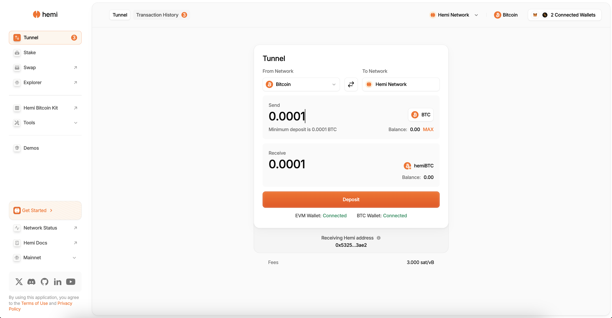

# Tunnel ETH to Hemi


## 📜 **TL;DR:**

* Acquire`ETH, which is essential` for initiating transactions and testing smart contracts on Hemi Testnet.
* Move your ETH to Hemi by using the Tunnel, enabling interactions within the Hemi Network ecosystem.


***

## 🏁 Prerequisites

1. To test out the tunnel on the Sepolia testnet, you can obtain ETH with any of the following options:
   1. [Hemi Discord Faucet](https://discord.gg/EcethnnA): Join the Hemi Discord to gain access to our community faucet and request ETH once per day.&#x20;
   2. [**Using Alchemy**](https://sepoliafaucet.com/): This method requires creating an account but is generally **faster**.
   3. [**Direct Faucet Access**](https://sepolia-faucet.pk910.de): If you prefer a no-account option, though it might be **slower**, use the Sepolia Faucet directly.
2. To ensure visibility of your `ETH` on the Sepolia testnet post-transfer, toggle the `Show test networks`option in MetaMask:
   * Select the drop down on the left
   * Toggle `Show Test Networks`
   * Select `Sepolia`

***

## 📚 Tutorial

### 1. Visit the Hemi Portal&#x20;

Go to [https://app.hemi.xyz/en/tunnel/](https://app.hemi.xyz/en/tunnel/) to tunnel your ETH from Sepolia to the Hemi network.

***

### 2. Connect Wallet

<figure><figcaption></figcaption></figure>

***

### 3. Connect to your Preferred Wallet

<figure><figcaption></figcaption></figure>

***

### 4. Click Connect

<figure><figcaption></figcaption></figure>

***

### 5. Tunnel Funds

* Enter the amount you would like to tunnel
* Click `Deposit`

<figure><figcaption></figcaption></figure>

* Click `Confirm`

<figure><figcaption></figcaption></figure>


**Note**: You can confirm your transaction was successful in the `Activity` tab of your MetaMask wallet.

.png>) :::

