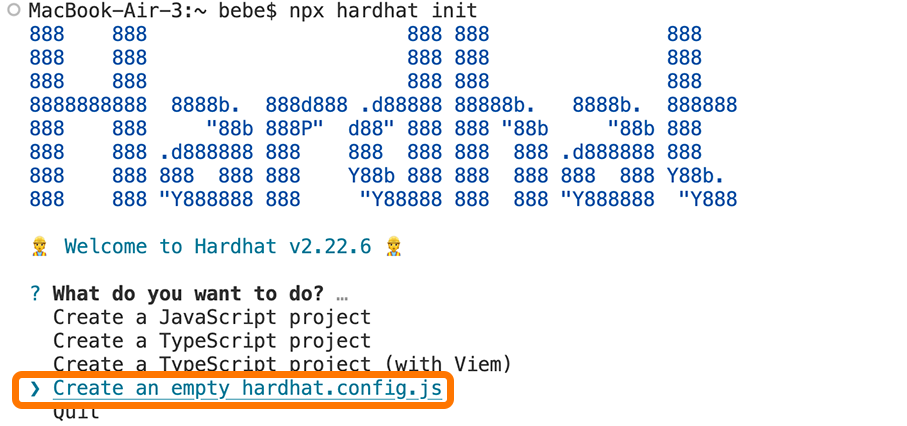
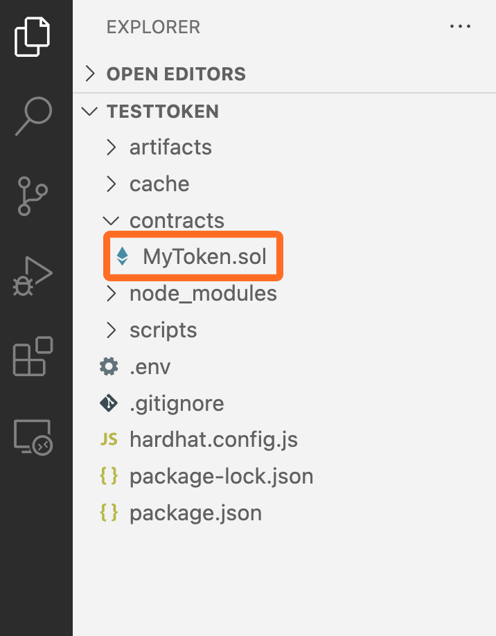
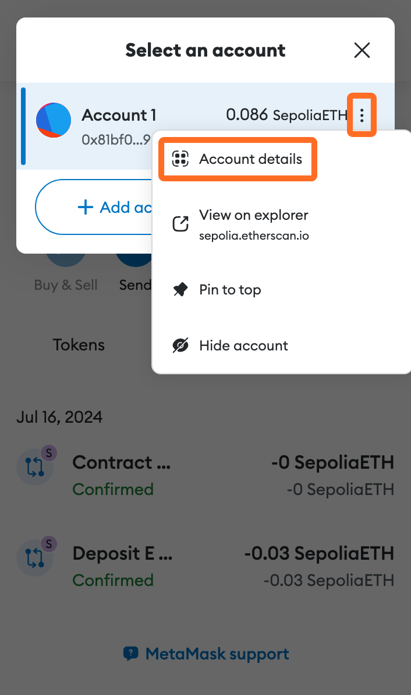
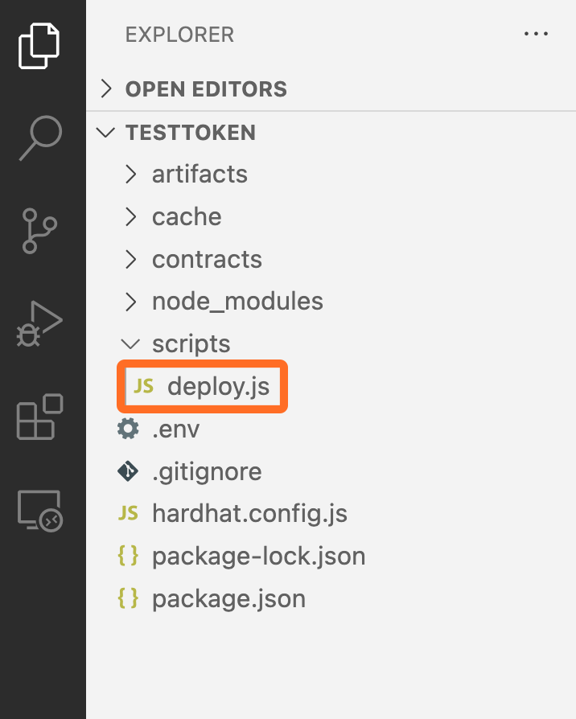
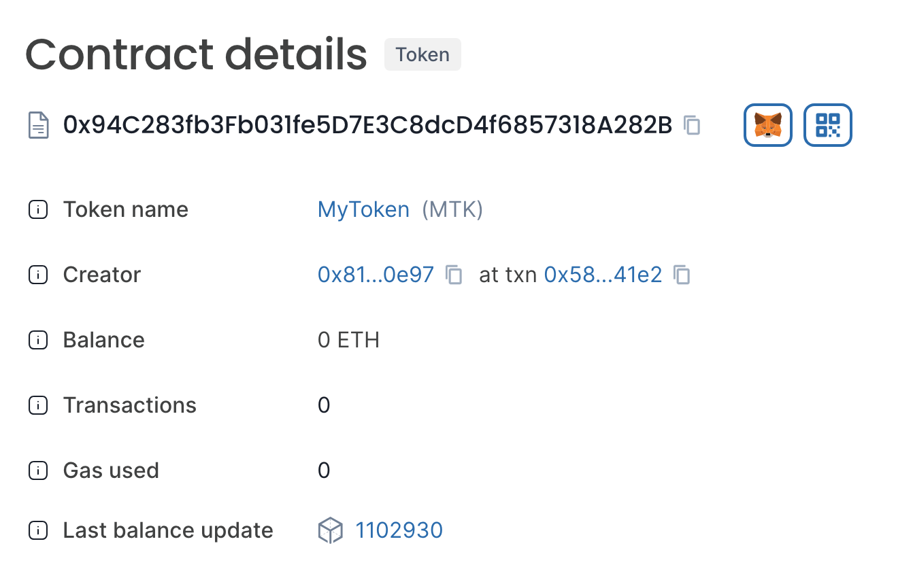

# Deploy an ERC-20 Token


## 📜 **TL;DR:**

* This tutorial guides you through deploying an ERC-20 token using [Hardhat](https://hardhat.org/), a comprehensive Ethereum development environment. Hardhat is recommended for its powerful features, but you can also use other Ethereum development tools like [Foundry](https://book.getfoundry.sh/).
* Ensure Node.js, Hardhat, and Solidity are set up correctly for effective ERC-20 token development and deployment.
* Earn and track Hemi [points](https://points.absinthe.network/hemi/start) for completing this tutorial!



***

## 🏁 Prerequisites

1. Download [VSCode ](https://code.visualstudio.com/download)(or any other IDE)
2. Install [Node.js](https://nodejs.org/en/download/) or update it to [current version](https://blog.hubspot.com/website/update-node-js)
3. [MetaMask Wallet Setup](metamask-wallet-setup.md)
4. [Tunnel ETH to Hemi](../using-hemi/tunneling/tunnel-eth-to-hemi.md)

***

## 📚 Tutorial

## Video



### 1. Create A Project Directory

* Create a folder on your computer and name it `TestToken`.
* This folder will serve as your project directory, containing all the elements and code needed to deploy your ERC-20 token.

***

### 2. Initialize Your NPM Project

* In your `TestToken` project directory, open a terminal window and initialize a Node.js project

```shell
npm init -y
```

***

### 3. Install Hardhat & Ethers.js Plugin

* Install Hardhat along with the Ether.js plugin, and the OpenZeppelin contracts library.

```shell
npm install --save-dev hardhat @nomiclabs/hardhat-ethers ethers @openzeppelin/contracts
```

***

### 4. Create a HardHat Project

a) Inside your Node.js project, start a Hardhat project

```shell
npx hardhat init
```

b) Select `Create an empty hardhat.config.js`



***

### 5. Add Folder

In the root directory of your project, create `contracts` and `scripts` folders:

```shell
mkdir contracts && mkdir scripts
```

***

### 6. Write Your Contract



* In the `contracts` folder, create a file named `MyToken.sol` . This will be your ERC-20 token contract. Here's a basic example:

```solidity
// SPDX-License-Identifier: MIT
pragma solidity ^0.8.0;

import "@openzeppelin/contracts/token/ERC20/ERC20.sol";

contract MyToken is ERC20 {
    constructor(uint256 initialSupply) ERC20("MyToken", "MTK") {
        _mint(msg.sender, initialSupply);
    }
}
```

* This code defines a simple ERC-20 token with an initial supply and basic ERC-20 functionalities.

***

### 7. Compile Your Contract

```shell
npx hardhat compile 
```

***

### 8. Secure Your Private Key for Deployment


Your private key provides access to your wallet and your funds. **Never share your private key with anyone.** Ensure this file is never shared or committed to version control.


a) Export your private key from MetaMask:

* Open MetaMask, select your account icon, and go to `Account Details`



* Select `Show private key`
* Enter your password.
* Select `Confirm`
* Select the unlock button to reveal your password.

b) Install `dotenv` package

```shell
npm install dotenv
```

c) Run the command `touch .env` to create an `.env` file in the root directory of your project.&#x20;

```
touch .env
```

d) Run the command `nano .env` to open the CLI editor&#x20;

```none
nano .env
```

e) Add your private key to the `.env` file.

```none
PRIVATE_KEY=your_exported_private_key
```

***

### 9. Configure Hardhat for the Testnet

a) Open `hardhat.config.js` in your project.

b) Configure Hemi Network

* Add the required modules at the top of the config file
* Add the Hemi Network settings in`module.exports`. Ensure you include the network's URL, Chain ID, and the accounts array with your private key (stored in an environment variable for security).

Here's an example configuration:

```javascript
/** @type import('hardhat/config').HardhatUserConfig */
require('dotenv').config()
require("@nomiclabs/hardhat-ethers");

module.exports = {
  solidity: "0.8.20",
  networks: {
    hemi: {
      url: "https://rpc.hemi.network/rpc",
      chainId: 43111,
      accounts: [`0x${process.env.PRIVATE_KEY}`],
    },
  }
};
```

***

### 10. Write a Deployment Script



In the `scripts` folder, create a file named `deploy.js` to write a script for deploying your contract.

```javascript
const { ethers } = require("hardhat");

async function main() {
    const [deployer] = await ethers.getSigners();
    const initialSupply = ethers.utils.parseUnits("1000", "ether");

    const Token = await ethers.getContractFactory("MyToken");
    const token = await Token.deploy(initialSupply);

    console.log("Token deployed to:", token.address);
}

main().catch((error) => {
    console.error(error);
    process.exit(1);
});
```

This script is deploying `MyToken` with an initial supply (customize the supply as needed).

***

### 11. Deploy the Contract

```shell
npx hardhat run scripts/deploy.js --network hemi
```


If the deployment is successful, you will see messages indicating the token was deployed to

`Token deployed to: 0x5fc5c2265E4f77E63e82f7F10FE803d04Cc53D82`



To view the details of your deployed contract, enter the contract address from your success message into the [Hemi Testnet explorer](https://testnet.explorer.hemi.xyz). This will provide you with information about the contract's transactions and state.

Contract details we just deployed:


