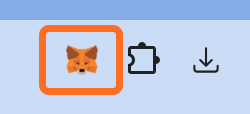
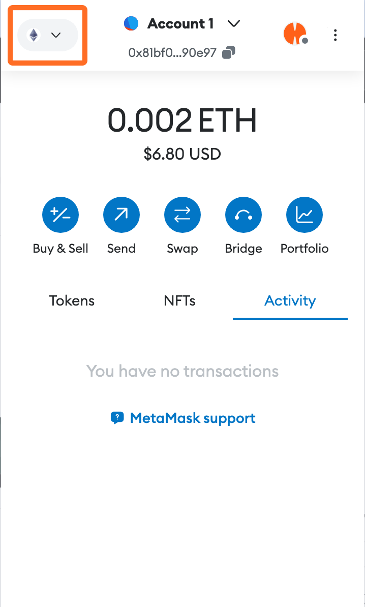
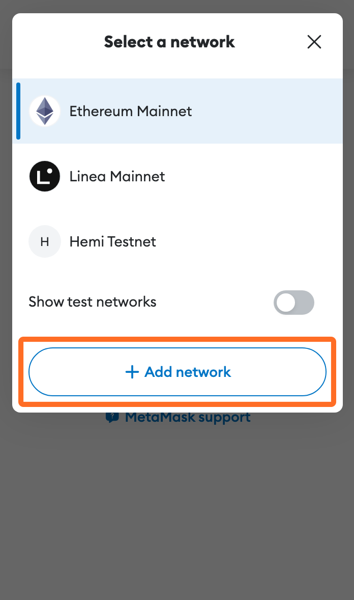
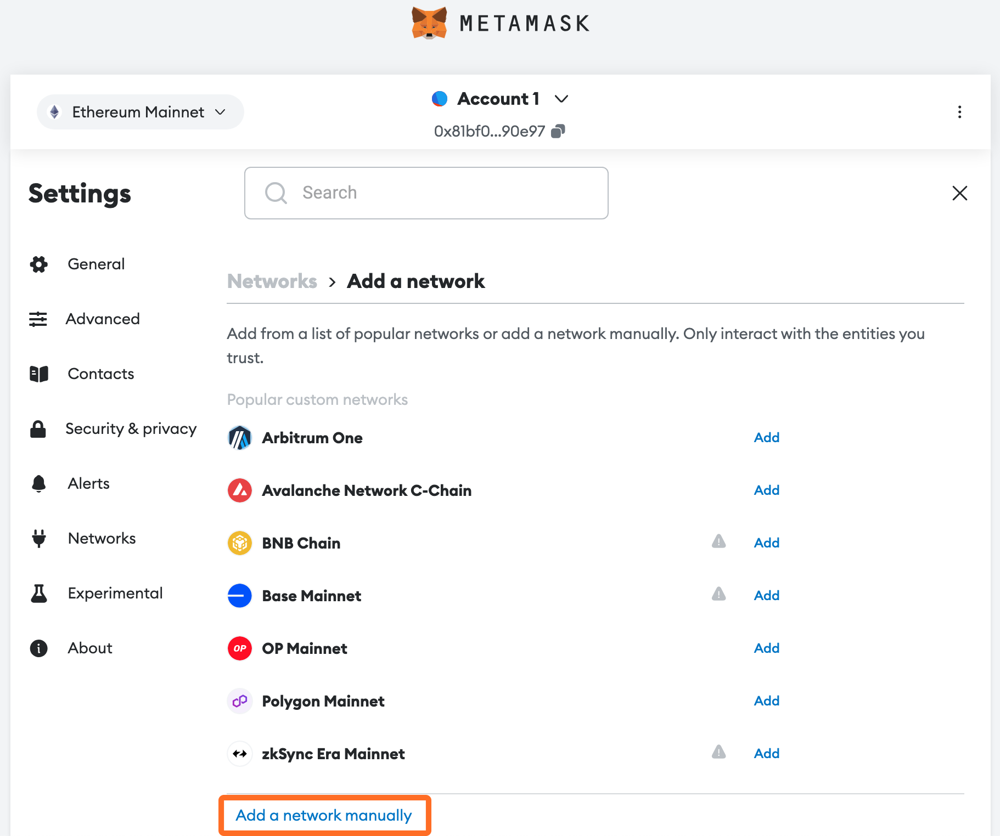
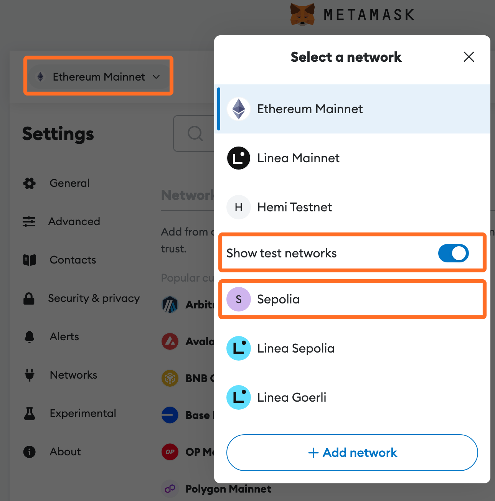

# EVM Wallet Setup


## 📜 **TL;DR:**

* [MetaMask](https://metamask.io/download/), available as a browser extension and mobile app, is designed to let users easily manage their cryptocurrencies and interact with dApps.
* This guide walks you through adding the Hemi network to MetaMask, including setting up network details like RPC URL, Chain ID, and Block Explorer URL.
* For a step-by-step guide on connecting MetaMask with a hardware wallet, please refer to [this guide from Ledger Academy](https://www.ledger.com/academy/security/the-safest-way-to-use-metamask).


***

## 🏁 Prerequisites

* [MetaMask Extension Download ](https://metamask.io/download/)to execute transactions and smart contract interactions within the Ethereum network.

***

## 📚 Tutorial

### 1. Open the MetaMask Extension

<figure><figcaption></figcaption></figure>

***

### 2. Access Network Selection Settings

Click on the network-selection dropdown, which is found at the top left of the MetaMask window.

<figure><figcaption></figcaption></figure>

***

### 3. Select "Add Network"

<figure><figcaption></figcaption></figure>

***

### 4. Add a Network Manually

<figure><figcaption></figcaption></figure>

***

### 5. **Enter Network Details**

In the "`Add a network manually"` settings, input the following information for the Hemi testnet network:

<table><thead><tr><th width="289"></th><th>Hemi testnet</th></tr></thead><tbody><tr><td><strong>Gas Token/Currency Symbol</strong></td><td>ETH</td></tr><tr><td><strong>ChainID</strong></td><td>743111</td></tr><tr><td><strong>RPC API endpoint</strong></td><td><a href="https://testnet.rpc.hemi.network/rpc">https://testnet.rpc.hemi.network/rpc</a></td></tr><tr><td><strong>Explorer</strong></td><td><a href="https://testnet.explorer.hemi.xyz">https://testnet.explorer.hemi.xyz</a></td></tr></tbody></table>

For Hemi mainnet, input the following information instead:

<table><thead><tr><th width="289"></th><th>Hemi mainnet</th></tr></thead><tbody><tr><td><strong>Gas Token/Currency Symbol</strong></td><td>TBD</td></tr><tr><td><strong>ChainID</strong></td><td>TBD</td></tr><tr><td><strong>RPC API endpoint</strong></td><td>TBD</td></tr><tr><td><strong>Explorer</strong></td><td>TBD</td></tr></tbody></table>

***

### 6. **Your EVM wallet is ready to go! 🎉**

Select `Save` to add the Hemi network to your MetaMask.

***

## 🔄 Switch between Ethereum Mainnet and Sepolia

After you have set up your EVM wallet on MetaMask, you may want to explore some of the unique features on Hemi testnet. This requires switching the connected network in your MetaMask wallet.


To ensure visibility of your `ETH` on the Sepolia testnet, toggle the `Show test networks`option in MetaMask:

* Select the drop down on the left
* Toggle `Show Test Networks`
* Select `Sepolia`


<figure><figcaption></figcaption></figure>

***

