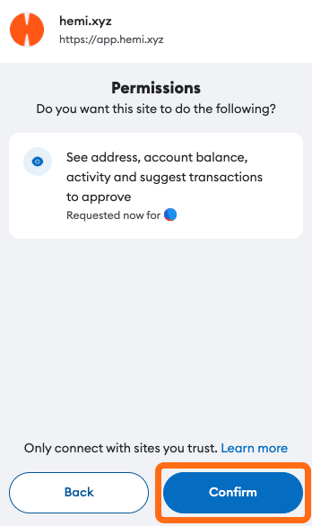

# Tunnel ETH to Hemi


## 📜 **TL;DR:**

* Acquire`ETH`, which is essential for initiating transactions and testing smart contracts on Hemi testnet.
* Move your ETH to Hemi by using the Tunnel, enabling interactions within the Hemi Network ecosystem.


***

## 🏁 Prerequisites

* **Acquire ETH** - ETH can be purchased on any number of exchanges and on-ramps. Hemi is currently integrated with [MetaMask](https://metamask.io) and we recommend MetaMask to purchase your ETH for the quickest onboarding. You may also visit other exchanges, such as Coinbase, to purchase and send your ETH to MetaMask.
* [**EVM (MetaMask) Wallet Setup**](metamask-wallet-setup.md) **-** Set up your EVM wallet and add the Hemi Network before interacting with any Hemi application.


**TESTNET ONLY**\
\
If you plan on developing on or interacting with Hemi testnet, alternative prerequisites may apply:

* To test out the Tunnel on the Sepolia testnet, you can obtain Sepolia ETH with any of the following options:
  1. [**Hemi Discord Faucet**](https://discord.gg/hemixyz): Join our Discord and tap our Hemi Sepolia ETH faucet!
  2. [**Using Alchemy**](https://sepoliafaucet.com/): This method requires creating an account but is generally **faster**.
  3. [**Direct Faucet Access**](https://sepolia-faucet.pk910.de): If you prefer a no-account option, though it might be **slower**, use the Sepolia Faucet directly.
* Learn how to [connect to the Sepolia network](../../main/start-here/developers.md).


***

## 📚 Tutorial

### 1. Visit the Hemi Portal&#x20;

Go to [https://app.hemi.xyz/en/tunnel/](https://app.hemi.xyz/en/tunnel/) to tunnel your ETH from Ethereum to the Hemi network.

***

### 2. Connect wallet

Click `'Connect Wallet'` in the top-right corner of the Hemi Portal.

<figure><figcaption></figcaption></figure>

***

### 3. Connect to your preferred wallet

Currently, MetaMask is the only EVM wallet Hemi supports. Our team is working to add additional  support for wallets such as Rabby, Phantom, and others.

<figure><figcaption></figcaption></figure>

***

### 4. Click confirm

<figure><figcaption></figcaption></figure>

***

### 5. Connect to the Ethereum Network

Ensure that you are connected to the Ethereum Network (mainnet or Sepolia). If you are not connected, the Portal will prompt you to connect.

<figure><figcaption></figcaption></figure>

***

### 6. Enter the amount of ETH to tunnel

Input the amount of ETH you wish to tunnel to Hemi.

<figure><figcaption></figcaption></figure>

After you have confirmed the gas fee and wish to proceed with the deposit, click `'Deposit.'`

***

### 7. Confirm the deposit in MetaMask

Confirm your ETH deposit in the MetaMask browser extension.

<figure><figcaption></figcaption></figure>

***

### 8. You have successfully tunneled ETH to Hemi! 🎉

Your transaction should now be complete! You can check the status and view the transaction in the `'Transaction History'` tab.

<figure><figcaption></figcaption></figure>


**Note**: You can also confirm your transaction was successful in the `Activity` tab of your MetaMask wallet.

.png>)


