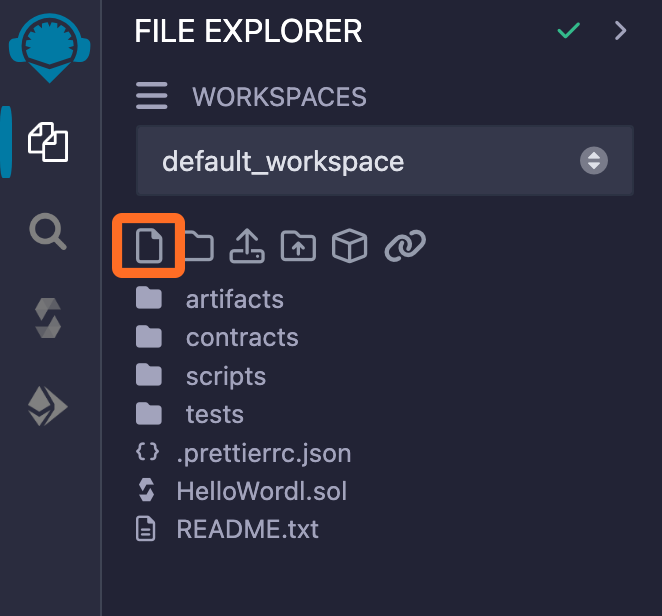
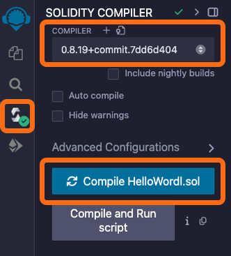
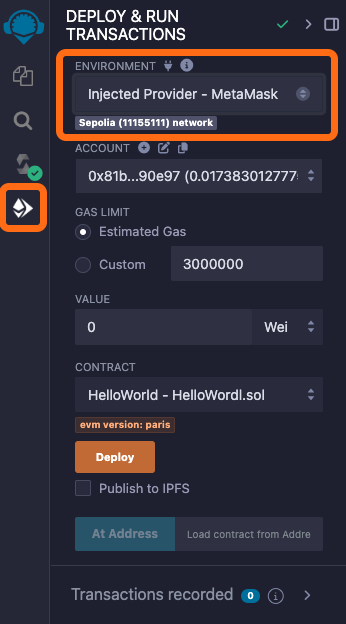
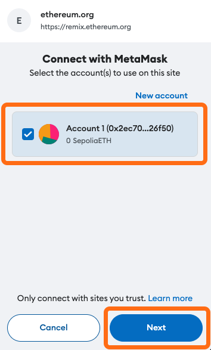
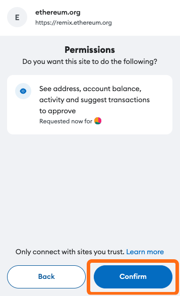
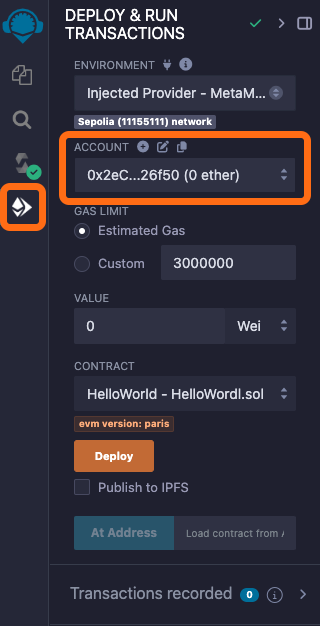
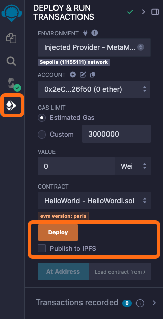
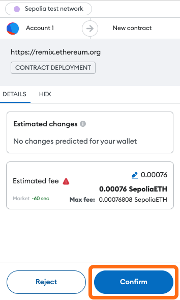

# Deploy a Smart Contract


## 📜 **TL;DR:**

* In this tutorial, we will utilize [Remix IDE](https://remix.ethereum.org/), a versatile, open-source web-based platform, to develop and deploy our smart contract onto Hemi testnet.
* This guide is tested to work with Solidity version **0.8.26.** If you experience any issues, try setting this version explicitly in the Solidity Compiler tab on Remix.
* Earn and track Hemi [Miles](https://points.absinthe.network/hemi/start) for completing this tutorial!


***

## 🏁 Prerequisites

1. [MetaMask Wallet Setup](../metamask-wallet-setup.md)
2. [Tunnel ETH to Hemi](../tunnel-eth-to-hemi.md)

***

## 📚 Tutorial

### 1. Go to [Remix IDE](https://remix.ethereum.org/)

Remix IDE is a powerful, open-source web application for developing, compiling, and deploying Ethereum smart contracts with ease.

***

### 2. **Add the Smart Contract**

In Remix IDE, start by creating a new file named `HelloWorld.sol`.



* The following contract is a basic example designed for interaction. Copy the code below and paste it into the file `HelloWorld.sol`.

```solidity
// SPDX-License-Identifier: MIT
pragma solidity ^0.8.0;

contract HelloWorld {
    string public greeting = "Hello, World!";

    function getGreeting() public view returns (string memory) {
        return greeting;
    }

    function setGreeting(string memory _greeting) public {
        greeting = _greeting;
    }
}
```

***

### **3. Compile the Contract**

Select `Compile HelloWorld.sol` button to use the Remix IDE's Solidity compiler. Check for any compilation errors and fix them.



***

### 4. Connect Remix To MetaMask&#x20;


The address you choose to connect **MUST** have some ETH (recommended at least 0.01 ETH) to pay for contract deployment fees. Refer back to earlier documentation to[ fund your Hemi address ](../tunnel-eth-to-hemi.md)with ETH.&#x20;


Choose `Injected Provider - MetaMask` under "Environment".



***

### 5. Confirm the Connection

* A pop-up from MetaMask will appear to confirm the connection. Select `Next`.



* Select `Connect`



***

### 6. Link to Hemi Account

* Link to the relevant Hemi account in the "Account" drop-down.



***

### 7. Deploy

Execute the deployment of your smart contract to the Hemi network directly from Remix IDE.


Uncheck `Publish to IPFS.`Note: if you get a warning about Gas Limit, you may ignore it and proceed.&#x20;


* Select `Deploy`



* Your MetaMask will pop-up to confirm the deployment of your smart contract. Select `Confirm`



🥳 Whoooo! If successful you should see a ✅ in the console.

⚠️ If it fails, double check that the Solidity version in the compiler is the correct version.


