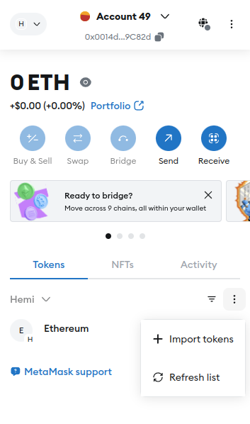
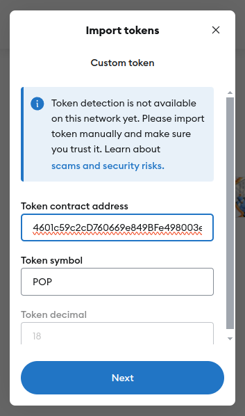

# (Mainnet) Add PoPPoints to Metamask


📜 **TL;DR:**

* **Prior to TGE, PoP miners on mainnet will receive PoPPoints tokens.**
* These points are entirely  separate from the Incentivized Testnet / Mainnet seasons.
* View your tHEMI balance and transactions directly in MetaMask.
* The tHEMI token contract address is `0xC5D2E164601c59c2cD760669e849BFe498003e21`.


***

## 🌐Overview

Prior to TGE, users who engage in securing Hemi (mainnet) to Bitcoin will receive PoPPoints tokens, which are distributed based on how many other users are actively PoP Mining.\
\
These PoPPoints tokens are initially non-transferrable. During the initial mainnet release, all miners who get a PoP publication for a keystone into Bitcoin within \~1.6 hours will share 100 PoPPoints for that keystone round.

As mainnet evolves, this payout algorithm will be adjusted.

***

## 📚 Tutorial

## Video



### 1. Open MetaMask

.png>)

***

### 2. Access Token Selection

* Navigate to `Tokens`&#x20;
* Click on the three vertical dots on the right of the token menu
* `Import tokens`

***

### 3. **Enter the Contract Address**

* Type in the tHEMI token contract address `0xC5D2E164601c59c2cD760669e849BFe498003e21` into the `Token Contract Address` field.

<figure><figcaption></figcaption></figure>

* If the address is recognized, MetaMask will automatically populate the `Token Symbol` and `Token Decimal` fields. For PoPPoints, you should see a symbol `POP`and 18 decimals.
*

### 4. Import

* Confirm the accuracy of the provided information, and then click on `Next`.
* If successful, you should see your PoPPoints tokens in your wallet's token list:

<figure><figcaption></figcaption></figure>

For now, these tokens are non-transferrable.
