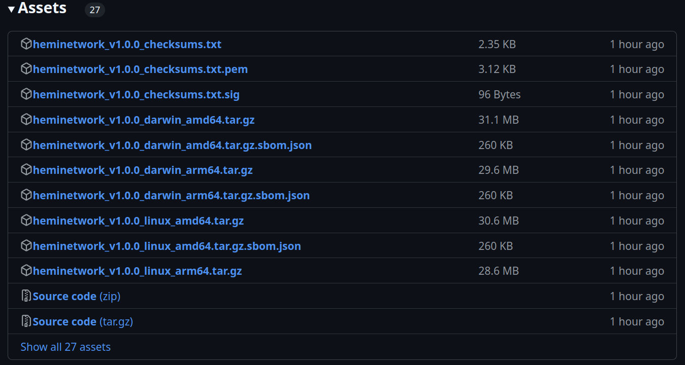

# CLI PoP Miner


#### 📜 **TL;DR:**

* This guide provides straightforward steps to download, set up, and run your PoP Miner, either by downloading **pre-built binaries** or by **building from source**.
* Ensure you have your development environment ready and follow the steps below to start PoP mining.
* Basic CLI skills are required.


***

## 🏁 Prerequisites

* Basic CLI Knowledge
* **BTC** (See [#bitcoin-fee-vb](./#bitcoin-fee-vb "mention") to understand how much BTC is required to PoP mine)

***

## 📚 Tutorial

## Video



### 1. Binaries

[Download a pre-built binary](https://github.com/hemilabs/heminetwork/releases) or [build from source using the README](https://github.com/hemilabs/heminetwork?tab=readme-ov-file#-building-from-source). Choose the release you want to use (_if unsure, choose the latest_), and click on `Assets` dropdown:

<figure><figcaption><p>Note: The version numbers may be different</p></figcaption></figure>

The package you will need to download depends on your OS and architecture:

* **Windows (Intel/AMD CPU):** heminetwork\_v1.0.0\_windows\_amd64.zip
* **Mac (Intel CPU):** heminetwork\_v1.0.0\_darwin\_amd64.tar.gz
* **Mac (Apple Silicon "M" CPU):** heminetwork\_v1.0.0\_darwin\_arm64.tar.gz
* **Linux (Intel/AMD CPU):** heminetwork\_v1.0.0\_linux\_amd64.tar.gz
* **Linux (ARM CPU):** heminetwork\_v1.0.0\_linux\_arm64.tar.gz

***

### 2. Extract the files

After downloading the necessary files, you must extract them from their compressed format before you can use or access the software. On most operating systems, you can right-click on the downloaded archive and choose "Extract" or similar.


**Linux/macOS tip**:

You can also use the command `tar xvf heminetwork_v1.0.0_linux_amd64.tar.gz`\
\
Run the `uname -a` command in the Terminal to view all system information, ensuring compatibility with the correct asset on GitHub.\
\
Depending on the output:\
"**x86\_64**" => Choose the "**amd64**" package corresponding to your OS\
"**arm64**" => Choose the "**arm64**" package corresponding to your OS


***

### 3. Open your CLI and navigate to the extracted folder

Launch your CLI:


**For Windows:**

* Press `⊞ Win` + `R` together to open the "Run Program Or File" Window
* Type "cmd" and press `Enter`

**For macOS:**

* Press `⌘` + `Space` together to open Spotlight Search
* Type "terminal" and press Enter

\
**For Linux:**

* Depends on OS. On Ubuntu (Gnome): `Ctrl` + `Alt` + `T`
* For most other distros, you can press `Super` (Windows Key) and search for Terminal.


Navigate to the folder you extracted by typing `cd` (**don't press `Enter` ye**t) and then drag the path of the extracted folder into your CLI, or type the path in manually and then press `Enter`.

* For example on Linux if you downloaded the package to your Downloads folder and extracted it through the GUI, you might run a command like:\
  \
  `cd '/home/<user>/Downloads/heminetwork_v1.0.0_linux_amd64'`

***

### 4. Confirm folder contents

List the files:


**For Windows:**

* `dir` (and press `Enter`) Type "cmd" and press `Enter`

**For macOS:**

* `ls` (and press `Enter`)


Your output should be:

*   **Linux & macOS**

    ```none
    bfgd    bssd    extool    hemictl    keygen    popmd    tbcd
    ```
*   **For Windows**

    ```none
    bfgd.exe    bssd.exe    extool.exe     hemictl.exe     keygen.exe     popmd.exe     tbcd.exe
    ```

***

### 5. Verify configuration success

To ensure you downloaded the correct binaries and are able to run them, execute the command below:

<table data-card-size="large" data-view="cards"><thead><tr><th></th><th></th><th></th></tr></thead><tbody><tr><td><strong>Linux &#x26; macOS</strong></td><td><p><mark style="color:purple;">⚠️ On Mac you will need to first remove the quarantine by running the following command in your Terminal:</mark></p><p><mark style="color:purple;"><code>xattr -d com.apple.quarantine ./popmd</code></mark><br><br><strong>Run</strong></p><p><code>./popmd --help</code></p></td><td></td></tr><tr><td><strong>Windows</strong></td><td><mark style="color:purple;">⚠️ <strong>Important Note for Windows Users</strong>: To successfully execute this command, you must use the Command Prompt (CMD), not PowerShell (which is the default terminal in environments like Visual Studio Code).</mark></td><td><p><strong>Run</strong></p><p><code>popmd.exe --help</code></p></td></tr></tbody></table>

This will display the help menu for `popmd`, indicating that it's installed and operational.

```none
Hemi Proof-of-Proof Miner v1.0.0+20630a55c (Hemi Labs, popmd, go1.23.7 linux/amd64)
Usage:
	help (this help)
Environment:
	POPM_BFG_REQUEST_TIMEOUT: request timeout for BFG (Bitcoin Finality Governor) (default: 15s)
	POPM_BFG_URL            : url for BFG (Bitcoin Finality Governor) (default: http://localhost:8383/v1/ws/public)
	POPM_BTC_CHAIN_NAME     : the name of the bitcoin chain to connect to (ex. "mainnet", "testnet3") (default: mainnet)
	POPM_BTC_PRIVKEY        : bitcoin private key (required) 
	POPM_LOG_LEVEL          : loglevel for various packages; INFO, DEBUG and TRACE (default: popmd=INFO;popm=INFO)
	POPM_PPROF_ADDRESS      : address and port popm pprof listens on (open <address>/debug/pprof to see available profiles) 
	POPM_PROMETHEUS_ADDRESS : address and port popm prometheus listens on 
	POPM_REMINE_THRESHOLD   : the number of L2 Keystones behind the latest seen that we are willing to remine, this is handy for re-orgs (default: 0)
	POPM_STATIC_FEE         : specify the number of sats/vB the PoP Miner will pay for fees (default: 1)
```


**Note:** Starting with v1.0.0, the PoP miner defaults to mainnet. If you want to PoP mine on testnet, you must specify "testnet" in the `POPM_BTC_CHAIN_NAME`.


***

### 6a. Generate public key


**If you prefer to PoP mine using a preexisting private key, you may skip step 6a and 6b.** You may import a private key from either an EVM or BTC address. For your BTC wallet (Unisat for example), use the HEX private key and not the WIF private key.



**Note:** The `net` flag in the **./keygen** command will default to "mainnet". If you are running a PoP miner in testnet, you must also add the flag `-net="testnet"`.


<table data-card-size="large" data-view="cards"><thead><tr><th></th><th></th><th></th></tr></thead><tbody><tr><td><strong>Linux &#x26; macOS</strong></td><td><p><mark style="color:purple;">⚠️ On Mac you will need to remove the quarantine by running:</mark></p><p><mark style="color:purple;"><code>xattr -d com.apple.quarantine ./keygen</code></mark></p></td><td><p><strong>Run the following command:</strong></p><pre data-overflow="wrap"><code>./keygen -secp256k1 -json  > ~/popm-address.json
</code></pre></td></tr><tr><td><strong>Windows</strong></td><td><p><mark style="color:purple;">⚠️ <strong>Important Note for Windows Users</strong>: To successfully execute this command, you must use the Command Prompt, not PowerShell (which is the default terminal in environments like Visual Studio Code). Follow these steps to open Command Prompt:</mark></p><ol><li><mark style="color:purple;">Click on the <strong>Start Menu</strong> button or press the <strong>Windows</strong> key on your keyboard.</mark></li><li><mark style="color:purple;">Type <strong><code>cmd</code></strong></mark> <mark style="color:purple;">into the search bar and open it.</mark></li><li>Type the following command and press Enter:</li></ol></td><td><pre><code><strong>keygen.exe -secp256k1 -json 
</strong><strong> > 
</strong><strong>%HOMEDRIVE%%HOMEPATH%\popm-address.json
</strong></code></pre><p><strong>Note:</strong> After running the command, you might not see any immediate feedback in the Command Prompt. This is expected behavior.</p><ol start="4"><li>Open the generated key file</li></ol><p>After generating the key file, you'll want to check its contents. To do this, use the following command in Command Prompt:</p><pre class="language-cmd" data-overflow="wrap"><code class="lang-cmd">%HOMEDRIVE%%HOMEPATH%\popm-address.json
</code></pre><p>This command opens the <code>popm-address.json</code> file in Notepad, allowing you to view or edit the generated key.</p></td></tr></tbody></table>

### 6b. Open the JSON

If you chose to generate a new private key in Step 6a, open your JSON to view your file contents.


**On Windows:** See the above instructions for how to open the file in Notepad.

**On Linux/macOS:** Run the following command to print the contents of your key file to the Terminal:\
\
`cat ~/popm-address.json`


You should see a result like:

```none
{
  "ethereum_address": "0x12345FabcD298299b8250e16eEb7D6a7B81DfEdC",
  "network": "mainnet",
  "private_key": "123456789abcdef123456789abcdef123456789abcdef123456789abcdef1234",
  "public_key": "04123456789abcdef123456789abcdef123456789abcdef123456789abcdef12345678abcdef123456789abcdef123456789abcdef123456789abcdef1234",
  "pubkey_hash": "m12345678P2xVWwVCWxq7tHJLGcJz2h6XYZ"
}
```

***

### 7. Fund your address

Find your wallet address:

* **New Address:** If you generated a new public key in Step 6a, check the JSON file from Step 6b for your `pubkey_hash`.
* **Existing BTC Address:** If you are importing a private key from an existing BTC address, [change your wallet type](https://docs.unisat.io/unisat-services/unisat-wallet/unisat-wallet-address-type) to P2PKH (Legacy) and locate the pubkey hash.
* **Existing EVM Address:** If you are importing a private key from an existing EVM address, [import your private key into UniSat](../../wallet-setup/btc-wallet-setup/) and select P2PKH (Legacy) as your wallet type.


**Best Practices for BTC Allocation**

We advise against sending large amounts of Bitcoin to the private key connected to your PoP miner. To run the miner, `~0.002 BTC` is required per day assuming a Bitcoin fee rate of 2-3 sat/vB. As a safety practice, consider sending only enough BTC for a week or a month at a time and refilling periodically.\
\
To determine how much BTC to send to your wallet, review [#bitcoin-fee-vb](./#bitcoin-fee-vb "mention").



**Testnet Mining**

If you want to test out PoP mining on testnet, you can get tBTC from faucets [like this one](https://coinfaucet.eu/en/btc-testnet/).


***

### 8. Run the Miner

In your console, execute the following commands while:

1. replacing `<private_key>` with either the value from your JSON file in Step 5 **OR** your preexisting EVM/BTC private key,
2. replacing `<fee_per_vB_integer>` with the fee in sat/vB you want to pay.


Read the [**"Bitcoin fee/vB"**](./#bitcoin-fee-vb) section below if you need help determining what value to set here.




**Linux & macOS**

```
export POPM_BTC_PRIVKEY=<private_key>
export POPM_STATIC_FEE=<fee_per_vB_integer>
export POPM_BFG_URL=wss://pop.hemi.network/v1/ws/public
export POPM_BTC_CHAIN_NAME=mainnet
./popmd
```

**Windows**

```
set POPM_BTC_PRIVKEY=<private_key>
set POPM_STATIC_FEE=<fee_per_vB_integer>
set POPM_BFG_URL=wss://pop.hemi.network/v1/ws/public 
set POPM_BTC_CHAIN_NAME=mainnet
popmd.exe
```

***

### 9. Expected Console Output

```none
2025-03-12 14:24:21 INFO popmd popmd.go:123 Hemi Proof-of-Proof Miner v1.0.0+20630a55c (Hemi Labs, popmd, go1.23.7 linux/amd64)
2025-03-12 14:24:21 INFO popmd popmd.go:127 POPM_BFG_REQUEST_TIMEOUT: 15s
2025-03-12 14:24:21 INFO popmd popmd.go:127 POPM_BFG_URL            : wss://pop.hemi.network/v1/ws/public
2025-03-12 14:24:21 INFO popmd popmd.go:127 POPM_BTC_CHAIN_NAME     : mainnet
2025-03-12 14:24:21 INFO popmd popmd.go:127 POPM_BTC_PRIVKEY        : ********
2025-03-12 14:24:21 INFO popmd popmd.go:127 POPM_LOG_LEVEL          : DEBUG
2025-03-12 14:24:21 INFO popmd popmd.go:127 POPM_PPROF_ADDRESS      : 
2025-03-12 14:24:21 INFO popmd popmd.go:127 POPM_PROMETHEUS_ADDRESS : 
2025-03-12 14:24:21 INFO popmd popmd.go:127 POPM_REMINE_THRESHOLD   : 0
2025-03-12 14:24:21 INFO popmd popmd.go:127 POPM_STATIC_FEE         : 5
2025-03-12 14:24:21 INFO popm popm.go:933 Starting PoP miner with BTC address 1Gz6cq1pR777GoVeDBcA7UbpnwTygGdknc (public key 02df4b526c0a81c90308cd88af993022782e167e7b25d69006b4649f8a47d545e1)
2025-03-12 14:24:22 DEBUG popm popm.go:855 Connected to BFG: wss://pop.hemi.network/v1/ws/public
2025-03-12 14:24:34 DEBUG popm popm.go:609 Received new keystone with block height 1326775
2025-03-12 14:24:34 DEBUG popm popm.go:602 Checking keystone received with height 1326800 against last keystone 1326775
2025-03-12 14:24:34 DEBUG popm popm.go:609 Received new keystone with block height 1326800
2025-03-12 14:24:34 DEBUG popm popm.go:602 Checking keystone received with height 1326825 against last keystone 1326800
2025-03-12 14:24:34 DEBUG popm popm.go:609 Received new keystone with block height 1326825
2025-03-12 14:24:34 DEBUG popm popm.go:543 Received keystone for mining with height 1326825...
```

***

### 10. 🎉 Congrats! You are now a Hemi PoP Miner!


Let us know how this process was for you via [Discord](https://discord.gg/hemixyz). We are constantly looking for ways to improve our documentation.


***

#### **Bitcoin fee/vB**

The Bitcoin transaction (normally represented in satoshis per virtual byte or sats/vB) is a fee paid to the Bitcoin miners to include a transaction in a Bitcoin block. It varies with network congestion, typically rising during periods of high transaction volume and decreasing when there is less activity.

* The PoP Miner consumes BTC to pay the Bitcoin miners to include PoP transactions in Bitcoin blocks.
* In order to ensure PoP transactions from your PoP miner are included in Bitcoin blocks, ensure the configured fee is set to an appropriate value. The PoP miner can be configured to use a certain fee in sats/vB by changing the `POPM_STATIC_FEE` environment variable when running the PoP miner. In a future version, the PoP miner will automatically calculate the current network fee to guarantee PoP transactions are included in Bitcoin blocks.
* The lower you set the fee, the less BTC you will pay per PoP transaction. If your fees are too low, Bitcoin miners may not include your transaction quickly enough for you to successfully PoP mine.

**Bitcoin fee determination:**

* Check Current Fee Levels: Visit [mempool.space](https://mempool.space/testnet) to see the current fee levels. Look at the "sat/vB" numbers for the different transaction fee priorities. It is recommended to set the value to the "High Priority" value or slightly higher.
* Set the Static Fee: Re-run the command to set the `POPM_STATIC_FEE` environment variable from above (`export` on Linux/macOS, `set` on Windows) each time you want to change the fee, and restart the PoP Miner afterwards.
